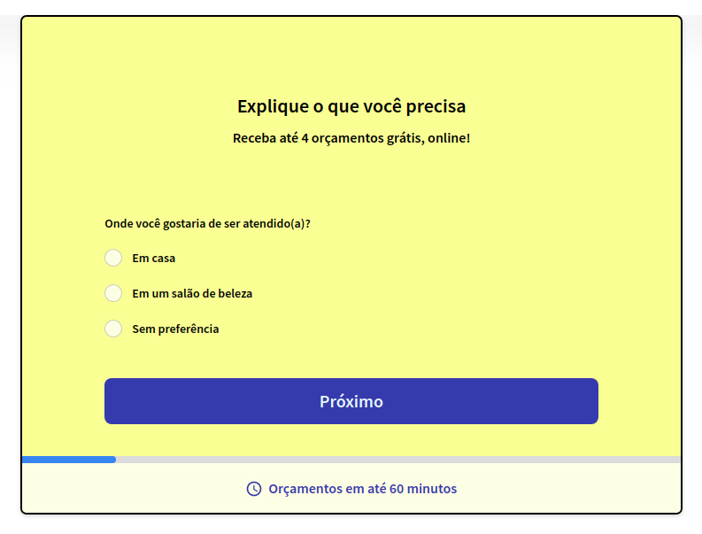
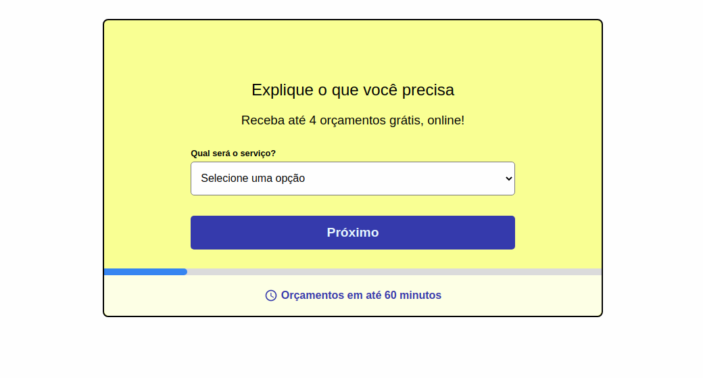

#

<!-- PROJECT LOGO -->
<br />
<p align="center">
    <h3 align="center">GetNinjas FrontEnd-Challenge</h3>

  <p align="center">
    This is a challenge required as part of a job selection by GetNinjas.
    <br />
    <a href="https://github.com/getninjas/frontend-challenge">Here's the original request.</a>
    <br />
    <a href="https://github.com/phfdonda/frontend-challenge/issues">Report Bug</a>
    ·
    <a href="https://github.com/phfdonda/frontend-challenge/request_feature">Request Feature</a>
  </p>
</p>

## Live Version

If you want to take a look and see how it is in practice, here's a live version for you:
[frontend-challenge](https://getninjas-challenge.herokuapp.com/)

This is an app deployed in Heroku, so please wait up to 30 seconds for it to load the first time.

### Screenshots of the project

The original form of GetNinjas looks like this:


The initial page looks like this:


<!-- TABLE OF CONTENTS -->

## Table of Contents

- [About the Project](#about-the-project)
  - [Restrictions](#restrictions)
  - [Objectives](#objectives)
  - [Installation](#installation)
  - [Instructions](#instructions)
  - [Built With](#built-with)
  - [Development Process](#development-process)
  - [Testing](#testing)
- [Contact](#contact)
- [Acknowledgements](#acknowledgements)

<!-- ABOUT THE PROJECT -->

## About The Project

This is a challenge requested as part of a hiring process.

### Restrictions

1. I am allowed to use:

- ES6 Javascript
- Linters, both for JS as well as for CSS
- Task runners/builders such as Webpack, Gulp, Grunt and such.

2. I am NOT allowed to use:

- JS Frameworks - React, Angular, Vue, you name it.
- Utility libraries - Underscore, Lodash, etc.
- CSS Frameworks - Bootstrap, Less, MaterializeCSS, and so on.

3. I AM allowed to use SCSS or SASS, but I have to give a good explanation about the real necessity of it.
4. Test frameworks are "allowed". The quotes are here because they are actually required, not allowed, as we'll see below.

### Objectives

1. The objective of this test is to evaluate the code's:

- organization;
- semantic;
- full use of features of HTML, CSS and Vanilla JavaScript;
- pattern usage;
- code performance;
- JavaScript **testing**. Like I said, required, not allowed.

2. I must create a server using Node.js to serve the fields.json file that is in the root folder as an API. I AM allowed to use Express.
3. I don't have to copy the whole [given page](https://www.getninjas.com.br/moda-e-beleza/cabeleireiros), only the request form. The fields must be dynamically assembled acording to the content of the fields.json file.

## Installation

Ruby is needed to run this file. Follow these steps to install it:
[TOP - Install Ruby](https://www.theodinproject.com/courses/web-development-101/lessons/installing-ruby)

Rails is also needed. To install it, follow the instructions in this link: [TOP - Install Ruby on Rails](https://www.theodinproject.com/courses/ruby-on-rails/lessons/your-first-rails-application-ruby-on-rails)

You can download the [repo](https://github.com/phfdonda/story-weavers) or clone (paste on the terminal) `git clone git@github.com:phfdonda/story-weavers.git`

Open the terminal and cd to the path where you download the project. It should be something like: `User/<folder>/story-weavers/`.

If you encounter a problem with yarn packages, run `yarn install --check-files`.

After that, you'll have to set up the database. In your terminal, run `bundle install`, then `rails db:create`, `rails db:migrate` and `rails db:seed`. Those steps are necessary to create the database, fill it with content in order to make the page run correctly.

To open it in your browser, you'll have to set a local server. To do that, in this terminal type `rails server`, or `rails s` for short. By default the port is set to 3000. In your browser url bar, type `localhost:3000`.

Enjoy!!

### Built With

- Ruby
- Rails
- VsCode
- Rubocop and Stickler for linting

## Development Process

I decided the theme beforehand, as if I was a client passing her business requirements before hiring me. I decided the name of the website would be storyWEavers.

### Business requirements

The business concept of the website is this: **the same way we programmers can open-source the development of software, with decentralized contribution of the community, what if we could open-source the development of stories?** My concept is a website where people can write their contributions that, if approved, will be "merged" into the main line of the story. Each chapter is actually a competition of sorts, where people can send their versions. During a time span, creators can write and publish "threads". The community can vote, propose changes, and if any of the most voted meets the criteria of the editing team, the chapter becomes part of the stream of events. The website is called storyWEavers because, because it is collective (therefore WE), and like weavers we will contribute with 'threads', the pieces of stories. After these threads are woven into a single fabric, we can publish the story - and the profits go to the contributors and the editing team. Since there's no single writer, but many writers called 'weavers', the focus is on the WE. It is a collaborative project of sorts, tapping into the collective creativity. How many great stories can be born like this?

### Translation of business requirements into software design

This is a project created initially as a Capstone Project for the Microverse course - so I have to follow the requirements of the project, at least until it is approved. After that I can take this project to new horizons.
As seen in the ERD, we have to create the following tables:

- Users
- Articles
- Categories
- Votes

However, although it is required of me to create a database that "reflects" this ERD, there is a fundamental flaw in the relationship diagram: we have a many-to-many relationship between Category and Article tables. I have to fix that, and by doing so it no longer "reflects" the ERD. The requirements of the project have no strict directions about this, so it is up to me. There are two options, if I want to make it as similar as possible: first, I could create a whole new table to make a "through" relationship; the other one is just changing the many-to-many into one-to-many.

The option that is most similar to the ERD is the last one, since we don't have to create a table that isn't there. Also, it better reflects our business requirements: if we consider the "category" a story, and each "article" a chapter, then you can't have a chapter that belongs to many stories, but a story will have many chapters. Therefore, one Category have many Articles still, but an Article has only one Category.

The business requirements would demand a "Comments" table, so users could comment to suggest modifications on possible chapters. However, we don't have that table in the ERD, and this project is a MVP. Let's leave that for later.

Users can vote, and those votes can be used for later logic - for example, to choose the "thread" that is going to be merged. For now, it's only used to choose the featured article that is displayed in the front page.

## Testing

For testing I used the gems `faker`, `factory_bot`, `capybara`, and `rspec_rails`, among a few others.

To test by yourself, open the terminal, cd into the folder and run ```rspec````.

If you have errors, you probably didn't set up the database correctly. Check again the section for [installation](#installation), and if necessary run `rails db:reset`.

<!-- CONTACT -->

## Contact

Pedro Henrique Ferreira Donda

Github - [@phfhdonda](https://github.com/phfdonda)

LinkedIn - [PedroDonda](https://www.linkedin.com/in/pedro-donda-808621bb/)

<!-- ACKNOWLEDGEMENTS -->

## Acknowledgements

- [Microverse](https://www.microverse.org/)
- [The Odin Project](https://www.theodinproject.com/)
- [Ruby](https://www.ruby-lang.org/en/)
- [Nelson Sakwa](https://www.behance.net/sakwadesignstudio)
